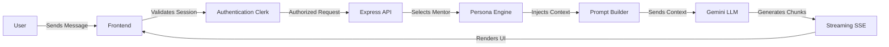
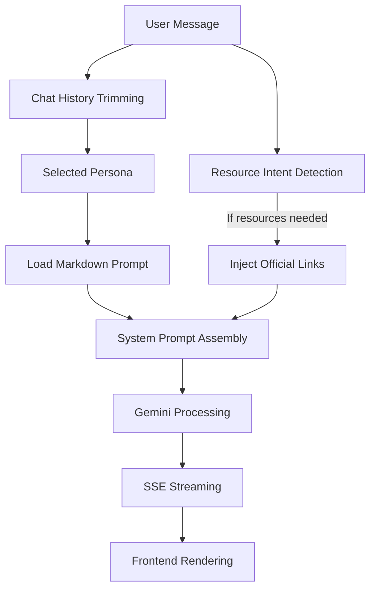
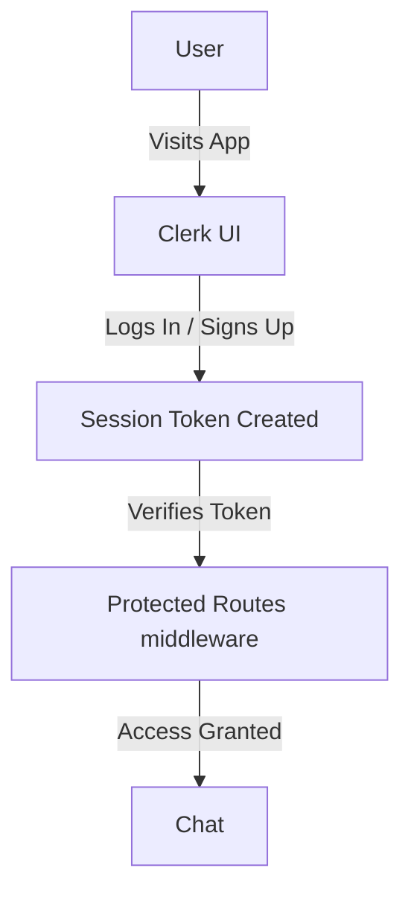
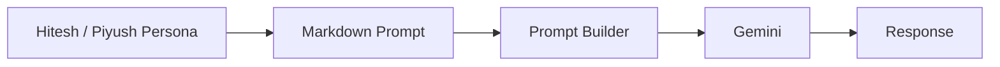

# ☕ Chai ki Tapri

An AI-powered developer hangout where users can have realistic conversations with AI versions of tech educators Hitesh Choudhary and Piyush Garg.


---

## 📸 Screenshots

public/images/home.png

public/images/loading_chat.png

public/images/chats.png

public/images/theme_toggle.png

public/images/profile.png
---

## ✨ Features

- [x] **AI Personas:** Chat with highly accurate, tailored AI personas of Hitesh Choudhary and Piyush Garg.
- [x] **Clerk Authentication:** Secure login, signup, and user session management.
- [x] **Real-time Streaming:** Smooth Server-Sent Events (SSE) for real-time AI responses.
- [x] **Chat History:** Stores and loads past conversations seamlessly.
- [x] **Persona Switching:** Easily swap between mentors depending on your learning needs.
- [x] **Dark / Light Theme:** Modern responsive UI with built-in theme toggling.
- [x] **Official Resource Recommendations:** Dynamically suggests official YouTube channels, websites, and GitHub repos.
- [x] **Daily Usage Limits:** Enforces a daily limit on interactions to prevent abuse.

---

## 🛠️ Tech Stack

- **Backend:** Node.js, Express.js
- **Frontend:** Vanilla JavaScript, EJS (Embedded JavaScript templates), Custom CSS
- **Authentication:** Clerk
- **AI:** Google Gemini (via `@google/generative-ai`), Groq (fallback)

---

## 📂 Project Structure

```text
chai_ki_tapri_v3/
├── config/
│   ├── resources.js        # Curated official resource links
│   └── security.js         # Security and usage limit configurations
├── middleware/
│   └── security.middleware.js # Auth and rate-limiting middleware
├── prompts/
│   ├── hitesh.md           # Master prompt for Hitesh persona
│   └── piyush.md           # Master prompt for Piyush persona
├── public/
│   ├── css/                # Stylesheets (chat, home, themes, variables)
│   ├── images/             # Static assets and icons
│   └── js/                 # Client-side logic (SSE streaming, UI managers)
├── services/
│   ├── cache.service.js    # Temporary caching for rate limits
│   ├── chat.service.js     # AI prompt compilation and history trimming
│   ├── resource.service.js # Resource intent detection and context formatting
│   └── youtube.provider.js # (Deprecated) Legacy dynamic search provider
├── utils/
│   └── security.utils.js   # Prompt injection detection utilities
├── views/
│   ├── chat.ejs            # Main chat interface template
│   ├── index.ejs           # Landing page template
│   └── profile.ejs         # User profile and stats template
├── .env.example            # Environment variables template
├── index.js                # Express server entry point
└── package.json            # Project dependencies
```

---

## 🚀 Installation

1. **Clone the repository:**
   ```bash
   git clone https://github.com/Krizh27/chai_ki_tapri_v3.git
   cd chai_ki_tapri_v3
   ```

2. **Install dependencies:**
   ```bash
   npm install
   ```

3. **Set up environment variables:**
   - Copy `.env.example` to `.env`
   - Fill in your API keys (see the Environment Variables section below).

4. **Run the application:**
   ```bash
   npm start
   ```

---

## 🔐 Environment Variables

Create a `.env` file in the root directory and configure the following variables:

| Variable | Description |
|----------|-------------|
| `CLERK_PUBLISHABLE_KEY` | Your Clerk frontend publishable key for user authentication. |
| `CLERK_SECRET_KEY` | Your Clerk backend secret key for validating sessions. |
| `GEMINI_API_KEY` | Your Google Gemini API key for the primary LLM engine. |
| `GROQ_API_KEY` | Your Groq API key used as a high-speed fallback LLM. |
| `PORT` | (Optional) The port your server will run on (defaults to 3000). |

---

## 🏃 Running the Project

**Development Mode:**
```bash
npm run dev
```

**Production Mode:**
```bash
npm start
```
The server will start at `http://localhost:3000`.

---

## 🔄 How It Works

The request lifecycle from the moment a user sends a message to when they see the response.



---

## 🧠 AI Response Pipeline

How the AI generates highly accurate, persona-driven responses.



---

## 🔑 Authentication Flow

How users securely access the chat interface.



---

## 📁 Folder Responsibilities

- **`config/`**: Houses static configurations, including the strict list of official mentor resources.
- **`middleware/`**: Contains Clerk authentication guards and rate limiters to protect the API.
- **`prompts/`**: The "brain" of the personas. Markdown files containing behavioral rules, formatting guidelines, and backstories for Hitesh and Piyush.
- **`public/`**: Client-side assets (CSS, JS, Images). Contains the logic for processing the Server-Sent Events stream.
- **`services/`**: The core business logic, including compiling AI prompts, detecting resource intents, and formatting chat history.
- **`utils/`**: Helper files containing utilities such as basic prompt injection detection.
- **`views/`**: EJS templates for server-side rendering of the UI structure.

---

## 🎭 Persona Architecture

The application relies on highly detailed Markdown files to instruct the LLM. 


These prompts define the mentors' communication style (e.g., Hinglish), teaching philosophy, hidden personality quirks, and strict negative constraints.

---

## 📚 Resource Recommendation

To ensure high-quality and safe recommendations, this project uses a strict curated resource policy.
- **Zero Hallucination:** The AI is completely forbidden from inventing URLs or suggesting random YouTube videos.
- **Ecosystem Locked:** Hitesh will only recommend his official channels (Chai aur Code, MasterJi), and Piyush will only recommend his (Teachyst, piyushgarg.dev).
- **Format:** The frontend maps special resource tags natively into sleek inline links pointing to official:
  - YouTube Channels
  - Websites
  - GitHub Profiles
  - Courses

---

## 🛡️ Security

This project implements multiple layers of security to protect the AI pipeline and user data:
- **Authentication:** Strict user verification using Clerk.
- **Rate Limiting:** IP and User-based limits prevent API spamming.
- **Usage Limits:** Users have a daily quota to manage LLM costs.
- **Basic Prompt Injection Protection:** Scans for patterns like "ignore previous instructions" and seamlessly injects hidden system reminders to keep the AI in character.
- **Input Validation:** Ensures payloads are strictly formatted strings.

---

## 🔮 Future Improvements

- **Conversation Memory:** Implementing a database (like MongoDB or PostgreSQL) to persist chats permanently across sessions.
- **Multiple Mentors:** Expanding the roster of tech educators.
- **Voice Chat:** Using WebRTC and Whisper AI to allow users to talk to the mentors.
- **Image Understanding:** Allowing users to upload screenshots of their bugs.
- **Vector Database (RAG):** Indexing the mentors' actual course transcripts to give 100% factually accurate code answers.
- **Better Analytics:** Tracking which concepts users struggle with the most.

---

## 🤝 Contributing

Contributions are always welcome! 

1. Fork the project.
2. Create your feature branch (`git checkout -b feature/AmazingFeature`).
3. Commit your changes (`git commit -m 'Add some AmazingFeature'`).
4. Push to the branch (`git push origin feature/AmazingFeature`).
5. Open a Pull Request.

---

## 📄 License

Distributed under the MIT License. See `LICENSE` for more information.
